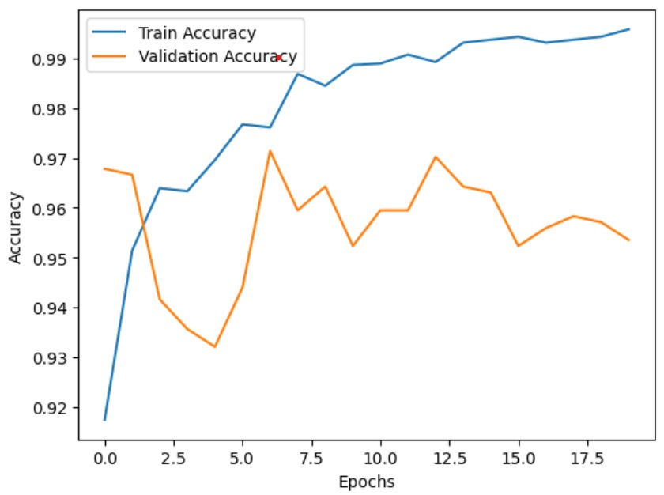
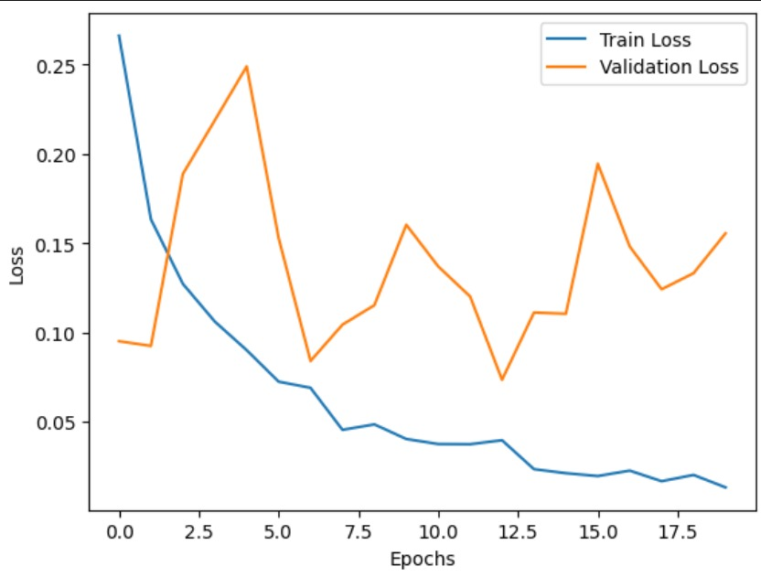

https://github.com/user-attachments/assets/119d84d9-ada3-4786-8e24-5df62cdd6eab

**Deployed Streamlit  Link:** : https://binary-dennsenet-121-w3gka5dxsgkq3u4vtlt95f.streamlit.app/

**Dataset Link :** : https://www.kaggle.com/datasets/paultimothymooney/chest-xray-pneumonia

**Trained Model Link :** https://drive.google.com/file/d/1Wh1whE0yodOiUaLHr1pn2NU-_a6M4Wu-/view?usp=drivesdk

# 🫁 Pneumonia Detection Model

> This Pneumonia Detection System is a medically oriented project
> designed to assist in the classification of chest X-ray images
> into Normal and Pneumonia categories with high reliability.
> The system is developed using **transfer learning** based on the
> **Pretrained model** **DenseNet-121**,which is  trained over
> the **millions  of feature image and thousands of classes** , this 
> enables  effective feature extraction and
> strong generalization on clinical imaging data.

## Model Performance Metrics :

> The model is evaluated across training, validation, and independent 
> Test datasets to present a transparent and comprehensive view
> of its learning behavior and real-world generalization performance.

### Training & Validation Performance

  | **Metric**              | **Value** |
|-------------------------|-----------|
| **Training Accuracy**   | **98.93%** |
| **Training Loss**       | **0.0395** |
| **Validation Accuracy** | **97.02%** |
| **Validation Loss**     | **0.0734** |

---
### Training , Validation Learning Curves :

### Training , Validation Loss Curves : 

### Test Set Performance (Unseen Data)

- **Test Accuracy:** **87.98%**

#### Classification Report (Test Data)

| Class       | Precision | Recall | F1-Score | Support |
|------------|-----------|--------|----------|---------|
| Normal     | 97.60%    | 69.66% | 81.30%   | 234     |
| Pneumonia | 84.46%    | 98.97% | 91.15%   | 390     |

---
### Recall Value Medical Interpretation : 

> - This  model achieves a **High Recall of 98.97% for Pneumonia**
> - on the test set, demonstrating strong sensitivity toward pneumonia-positive cases.
> - In Medical Recall Value  must be 100  Percent but due to limitations of GPU , 
> - could not able to achive  **100 percent Recall value** . Since even missed while
> - detecting only one time Disease  is **Dangerous in Medical Field** .

- Although recall for the Normal class is lower,
- the overall behavior reflects a **safety-oriented  design choice**,
- prioritizing detection of pneumonia cases.

Accuracy
1.00 |                           ________ Train
0.99 |                      _____/
0.98 |                 _____/
0.97 |            _____/        ---- Validation
0.96 |       _____/        ----
0.95 |  ____/        ----
0.94 |_/        ----
     +-----------------------------------------
        1   3   5   7   9   11  13  15  17  19
                         Epochs

